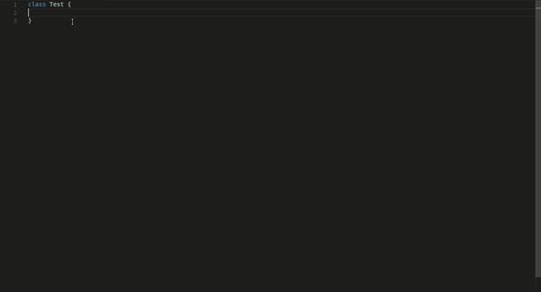

# Awesome plugin for VsCode :sunglasses: [Beta]

## Quickly see docs from mdn on your vscode

If you are coding and in middle you forget syntax or description about any javascript api then just
write ` //mdn [api] `. for example `//mdn object` or if you want to see documentation about `assign` method of `Object` then just type `//mdn object.assign` and don't forget to end it with `;`(semicolon).

## Usage
Load documentation of top level or global objects by
        

    //mdn [object]
    example: `//mdn array;` 

Load documentation of method of global or top level object by

    //mdn [object].[method]
    example: //mdn array.from;

### Semicolon?
Semicolon is necessary at end of line to trigger search so 
don't miss to add semicolon at the end.

### Example syntax
`//mdn document` Will load documentation about `document`
`//mdn object.keys;` Will load documentation about `object.keys`

`//mdn object.values;` Will load documentation about `object.values`

`//mdn array.slice;` Will load documentation about `array.slice`

`//mdn array.splice;` Will load documentation about `array.splice`
